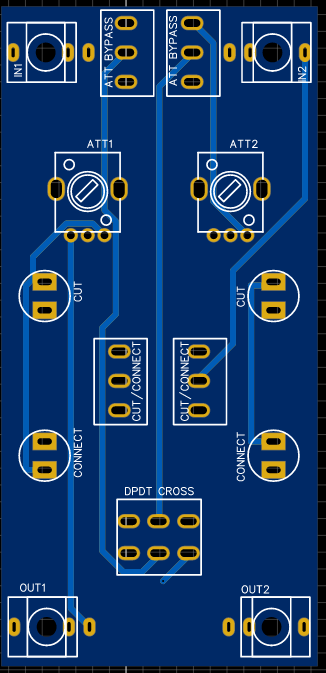

# Krach X-Switch Eurorack performance Module

Recently, I was commissioned by [Krach der Roboter](https://www.facebook.com/KrachDerRoboter/) who had the idea to design a passive performance tool based on the idea of quickly switching signal paths. What came out of it is this simple and useful module:

 

## Function

The core function of the module revolves around the "cross-switch". Two input channels are attenuated independently and then go to the output, but if you flip the cross switch, the Input 1 goes into output 2 and vice versa. This allows for fast back and forth switching of cv signals.
Additional pushbuttons can be used to cut or connect a lane. Spacing between components is rather large to allow his robot hands to reach everything easily.

This is also meant as an absolute beginner/first DIY module, so everything is made to be very easy to solder and all the traces are rather large so nothing gets damaged.

## PCB and Hardware

 

You can find the schematic and BOM in the root folder.
For the PCBs, the module has one circuit PCB and one panel PCB. 
You can order them on any common PCB manufacturing service, I used [JLCPCB](https://jlcpcb.com/).

Standard settings should be fine, but as there is exposed copper on the panel you should go with a lead free surface finish (ENIG/Leadfree HASL).
If the panel sizes are not recognized correctly (may happen with my export sometimes) just put 128.5x50mm.

For the push switches, we used these, but you can use any that will somewhat fit the footprint and have <m7 thread on the top.

## Assembly
Should be very straight forward, as always it is best to mount the components on the panel first before soldering so that they are properly in place.
